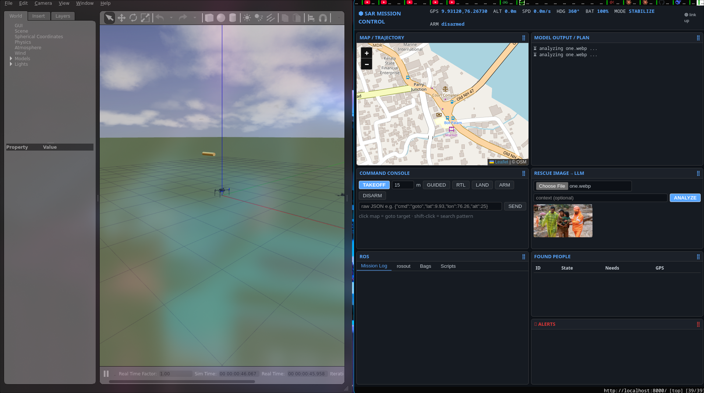
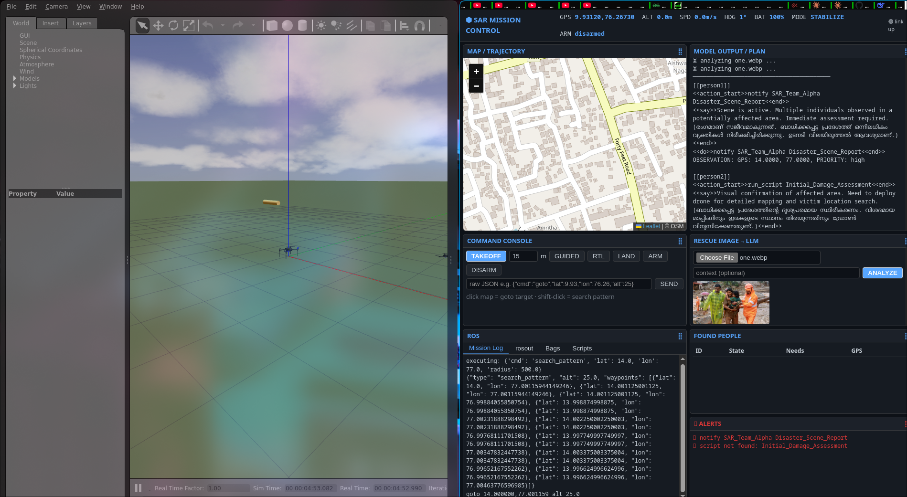

# Drone rescue 

runs a reasoning model to detect and report actual data and victims.

gives MAVROS command for the gazebo drone to execute and act on.

can converse in other languages like hindi malayalam etc because of the gemma model under the hood

can keep track of all the victims and there request and act upon request like a assistant,

